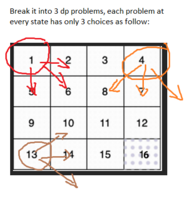

# Intuition
- We can intuitively know that this is a dp problem as it is very similar to [this problem](https://leetcode.com/problems/cherry-pickup-ii/description/)
- Now that we know it, we can try breaking the 3 childs into 3 seperate dp problems and solve each one, then we can get the sum as the final result
    - There is one problem though, as the problem stated that the fruits of every position can only be taken once, so after calculating each child, we have to **mark the optimal path** of that child to 0 to avoid over counting.



- As there are only `n-1` moves and we **HAVE TO** arrive at position (n-1,n-1) for the result to be valid we can:
    - Rebuild the optimal path using the memoize table
    - For the first child at position (0,0), there is only 1 valid path going diagonal, so we can simply do a for loop to calculate and mark it as 0.

# Approach
- We break down the problem into 3 smaller dp problems: `top_left`, `top_right`, `bottom_left`, do the dp calculation for each one
- For the `top_left`, we can just calculate the diagonal path from this position and set each cells to 0 because this is the only path
- For the next child, after calculate the optimal result, we can rebuild the optimal path and set its cells to zero with `cleanup`
- The 3rd child we can just do dp calculation and return the sum, no need to mark its path.
- For the dp recursive function:
    - At each state, we have 3 choices (3 way to move)
    - The states variables are the `x` and `y` coordinates, I used `r` and `c` which is short for row and column.
    - The base cases are:
        - Position out of bound, check with `valid()`
        - Out of moves but still have not arrived at the destination `if(moves == 0 && !(r == n-1 && c == n-1)) return INT_MIN;`
        - When we arrive at the destination `if(r == n-1 && c == n-1) return 0;`
        - When we have already calculated this path `if(dp[r][c] != -1) { return dp[r][c]; }`
    - The recursive formula is pretty simple, we just try to get max fruits from three choices `dp[r][c] = max({3 choices here})`

# Complexity
- Time complexity: $O(n^2)$ size of the board

- Space complexity: $O(n^2)$ for the memoize `dp` table

# Code
```cpp []
class Solution {
public:
    vector<vector<int>> dp;
    int n;
    bool valid(int r, int c) {
        return min(r, c) >= 0 && max(r, c) < n;
    }
    int dfs_topr(vector<vector<int>>& fruits, int r, int c, int moves) {
        if(!valid(r, c)) return 0;
        if(moves == 0 && !(r == n-1 && c == n-1)) return INT_MIN;
        if(r == n-1 && c == n-1) return 0;
        if(dp[r][c] != -1) {
            return dp[r][c];
        }
        int left = fruits[r][c] + dfs_topr(fruits, r+1, c-1, moves-1);
        int down = fruits[r][c] + dfs_topr(fruits, r+1, c, moves-1);
        int right = fruits[r][c] + dfs_topr(fruits, r+1, c+1, moves-1);
        dp[r][c] = max({left, down, right});
        return dp[r][c];
    }
    int dfs_botl(vector<vector<int>>& fruits, int r, int c, int moves) {
        if(!valid(r, c)) return 0;
        if(moves == 0 && !(r == n-1 && c == n-1)) return INT_MIN;
        if(r == n-1 && c == n-1) return 0;
        if(dp[r][c] != -1) return dp[r][c];
        int up = fruits[r][c] + dfs_botl(fruits, r-1, c+1, moves - 1);
        int right = fruits[r][c] + dfs_botl(fruits, r, c+1, moves - 1);
        int down = fruits[r][c] + dfs_botl(fruits, r+1, c+1, moves - 1);
        dp[r][c] = max({up, right, down});
        return dp[r][c];
    }

    void cleanup(vector<vector<int>>& fruits) {
        int r = 0, c = n-1;
        while(valid(r, c)) {
            int f = fruits[r][c];
            fruits[r][c] = 0;
            r++;
            if(valid(r,c-1) && dp[r][c-1] == f + fruits[r][c-1]) {
                c--;
                continue;
            }
            if(valid(r,c) && dp[r][c] == f + fruits[r][c]) {
                continue;
            }
            if(valid(r, c+1) && dp[r][c+1] == f + fruits[r][c+1]) {
                c++;
                continue;
            }
            break;
        }
    }
    int maxCollectedFruits(vector<vector<int>>& fruits) {
        int res = 0;
        n = fruits.size();
        for(int i = 0; i < n; i++) {
            res += fruits[i][i];
            fruits[i][i] = 0;
        }
        dp.assign(n+1, vector<int>(n+1, -1));
        res += dfs_topr(fruits, 0, n-1, n-1);
        cleanup(fruits);
        dp.assign(n+1, vector<int>(n+1, -1));
        res += dfs_botl(fruits, n-1, 0, n-1);
        return res;
    }
};
```